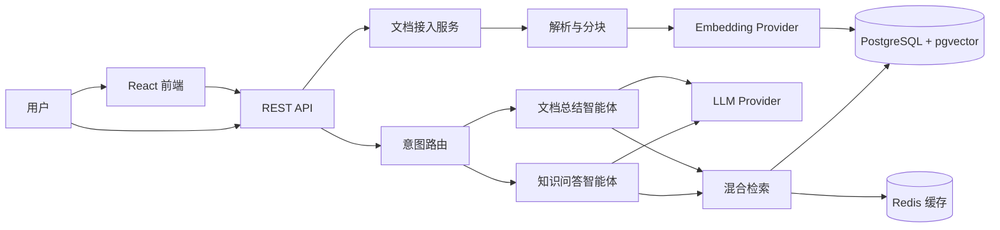

# 架构设计

## 总体架构

## 分层职责

| 层 | 职责 |
| --- | --- |
| 接入层 | React 前端、REST API、文件上传 |
| 安全层 | API Key 鉴权开关、CORS、输入校验 |
| 编排层 | 意图路由、智能体注册、会话上下文 |
| 智能体层 | 知识问答、文档总结，按业务场景扩展 |
| 检索层 | 向量检索 + PostgreSQL 全文检索 + RRF 融合 + 重排 |
| 服务层 | 文档解析、分块、Embedding、记忆、引用生成 |
| 数据层 | documents、chunks、conversations、messages |

## RAG 数据流

1. 上传文档后进入后台任务：解析文本 -> 按段落分块 -> 调用 Embedding -> 写入 chunks 表。
2. 用户提问后，意图路由选择智能体。
3. 检索服务将问题向量化，同时执行向量检索和全文检索。
4. 使用 Reciprocal Rank Fusion 合并两个召回列表，再做重排。
5. 智能体把命中的文本块拼进上下文，要求 LLM 只基于材料回答并输出引用。
6. 回答、命中文档、页码和片段一起返回前端展示。

## 智能体扩展

新增一个智能体只需两步：

1. 在 `backend/app/agents` 下实现 `BaseAgent`。
2. 在 `AgentRegistry` 中注册，并补充路由提示词与关键词规则。

当前内置智能体：

| 智能体 | 名称 | 触发场景 |
| --- | --- | --- |
| 知识问答 | knowledge | 默认问答、事实查询 |
| 文档总结 | summary | 总结、摘要、归纳、概览 |

## 安全与合规预留

- `ENABLE_AUTH=true` 时所有 API 需要 `X-API-Key`，支持两级权限：
  - `API_KEYS`：普通用户，可上传文档、提问、查看会话
  - `ADMIN_API_KEYS`：管理员，可额外删除文档
- `DEBUG=false` 时自动关闭 `/docs`、`/redoc`、`/openapi.json`。
- 数据模型使用 UUID 主键，便于后续多租户改造。
- 引用溯源记录来源文档和页码，满足可审计要求。
- Redis 缓存 Embedding 结果，控制重复调用成本。
